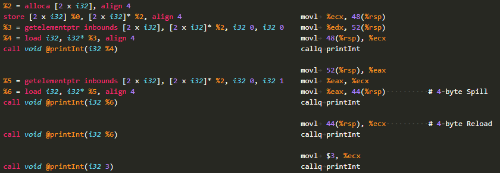

Title: Latent Access Optimisations
Date: 1/08/2020
Tags:
Related: ./doc/qupa-decision-pointers.md
---
How delaying memory reads, write and execution can have a compounding optimisation effect
---

> THIS DOCUMENT IS STILL UNDER DEVELOPMENT AND STILL CONSIDERED DRAFT FORM

## Abstract

When CPU registers/stack values are reused instead of needing reloading this can decrease the number of read operations necessary. Similarly if you hold computation results in registers, and only write the value to memory when necessary some writes may not need to be performed as values get over written.
These two effects combined with only allocating memory when accessing the address of the element is necessary can completely remove some function variables from the heap and instead they are completely resolved within registers/stack values without any extra processing or analysis required.

## Asumptions

These optimisations presume:

1. _Single-threaded Execution_ - hence if they are used in a multithreaded environment they can cause unexpected behaviour. However this does not mean that they cannot be used for multithreaded applications, instead if means that consideration about multithreaded concurrency is required when implementing a program using these optimisations, such as marking points where the values should be flushed, or any caches should be droped.
2. _Single parse_ - a given function should be compiled in a single sweep. This means affects can only be accounted for linearly, hence in a section of code where looping occurs assumptions or known information may be discarded.
3. _Functional Independance_ - all functions are compiled only knowing their own behaviour, and cannot affect the behaviour of other functions and instead may only assume information provided during earlier stages of compilation (i.e. function signatures). Hence one function does not know what will occur to any value parsed to another. Hence when pointers are parsed to other functions, all known information about the pointer's value is lost.

## Background

Throughout this article the focus is on LLVM-IR level of abstraction. This has been chosen due to it's high proximity to assembly and thus machine code - however it still maintains a relatively high level of readability, thus making explinations and examples simpler.

### About LLVM-IR

Within LLVM local variables are typically defined as purely addresses via the instruction ``alloca typename``. This static allocation is typically translated to a section of memory on the heap for a given function however this is not always the case due to the target platform/assembly's behaviour. However reducing the number of ``alloca``s will reduce the stack size, and thus in most cases also reduce the amount of reads required from different levels of CPU cache, decreasing latencies and delays within a program which impacts performance.

All variables can only be assigned once within LLVM. Hence if you want a variable you need to define an address to the type you want, then you read and write to that address. However that local variable name cannot be assigned multiple times within the same function. This is not the same as a constant however - because if the execution jumps to a previous line (for example during a while loop), then the value of the local variable will change.

## Terms

| Term | Used to mean |
|:-|:-|
| Register | A local LLVM variable |
| Concurrency | Used within this document to refer to the more broad interpretation of any execution occuring within the same time period. Hence it can apply to single threaded behaviour, such as calling a function within another. The child function is enacting concurrent behaviour because it occurs during the same time as the caller. |

## Stage 1: Read Caching

> When a value is read, from memory the register used to store the result should be reused in place of reloading the value until such as time as the original is altered or presumed to have changeed in some way.

The below example was compiled with both Clang++ and also transpiled then compiled with Qupa. Please note that C++ aims for assembly level linking compatability, hence why it is using integer pointers rather than an array at the LLVM-IR level.

---

The C++ compiled version is 19 lines of assembly, and includes multiple redundant reloads, and recalculations of addresses

---

The Qupa compiled version is only 12 lines of assembly, because it reused as many values as it could, hence for some prints no extra calcuations were needed to run the next print. And in the final case the compiler knows that the value at that point is a constant primative - hence it instead directly uses that value rather than requiring any registers to be used.

Also note that the two assignments are not computed. This is due to the fact that the no accessing of sub components of the values occurs, hence they can just be kept in registers in whole form. This is covered later in [stage 2](#stage-2-latent-writing).

### Risks and Mitigation

*TODO*

* Writing to unknown points in an array
* Pointers being parsed to functions

## Stage 2: Latent Writing

*TODO*

## Stage 3: Latent Allocation

*TODO*

## Scenarios and Safeties

*TODO*